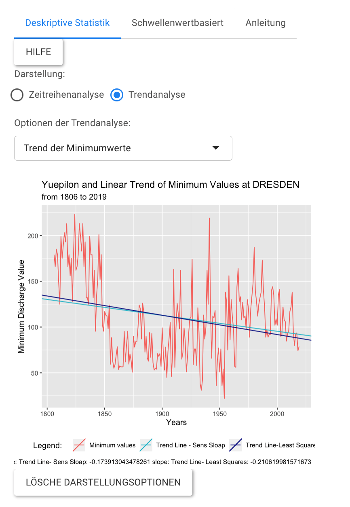
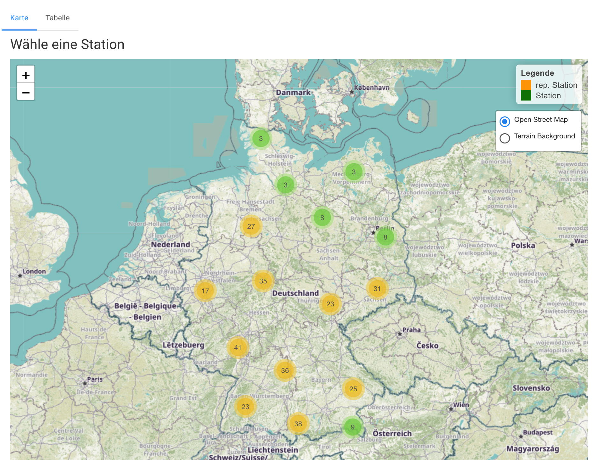

<!-- README.md is generated from README.Rmd. Please edit that file -->

# dischanalyst

<!-- badges: start -->

<!-- badges: end -->

The goal of dischanalyst is to offer an easy discharge analysis. Uses a
statistical approach to analyse hydrological data. Was created for a low
flow Analysis. Therefore a discharge time series is required. Helps to
create a descriptive statistical and graphical summary of a dataset.

By combining the read-in, ordering and analysis functions, it is
intended to simplify the workflow and serve as a useful tool to bundle
several steps of the analysis and to enable a comprehensive analysis by
integrating different approaches. By the fact that the functions are
co-ordinated with each other, a smooth workflow is to be made possible.

## Installation

You can install the development version of dischanalyst from
[GitHub](https://github.com/) with:

``` r
# install.packages("devtools")
devtools::install_github("maibrittbergh/dischanalyst")
```

## Workflow

*dischanalyst* can be applied to the GRDC
(<https://www.bafg.de/GRDC/EN/Home/homepage_node.html>) data set or to
hydrological and climatological time series corresponding to the
structure of the GRDC discharge measurement series. Accordingly, a date
(YYYY-MM-DD) must be available for each daily measured value. As soon as
a data set of this structure is available, it can be read in, structured
and analyzed with the help of *dischanalyst*.

## Structure

The structure of the package corresponds to the structure of the Web
application (<https://github.com/maibrittbergh/dischanalapp>). It is
possible to either do a station-related analysis or an area-wide
(Germany-wide) analysis. Therefore, the package contains:

1.  Functions for reading in and structuring the data
2.  Functions for the statistical analysis of individual measurement
    series. These include descriptive analyses, threshold-based and
    non-threshold-based low water analysis, and trend analysis.
3.  Functions to generate and understand Germany-wide low water trends

Since the package was developed with the objective of a “low water
analysis for Germany”, there are few functions that are exclusively
applicable to the Germany-wide analysis and also the *representative
stations* that are partially integrated into the analysis are
exclusively available for Germany. Apart from these limitations, a
comprehensive descriptive and a low water analysis with the R package is
also possible for any other country for which data are available.

## Examples

### Station based Analysis

``` r
  
        trendpl=function(){
          if (input$trendpltype=="Trend der Minimumwerte"){
            
            plotr=Qmin_trend(data=data2,  station=stat_name, mod=1) 
            return(plotr)
          }
          if (input$trendpltype=="NMxQ-Trend"){
            x_val=input$xVALUE
            
            plotr=NMxQ_trend(data=data2,  station=stat_name, x=x_val, seasonal=season, graphic=T)
            return(plotr)
          }
          if (input$trendpltype=="Trend der Mittelwerte"){
            
            
            plotr=MQ_trend(data=data2,  station=stat_name, seasonal=seas )
            return(plotr)
          }
        }
```

A possible **Output**:

<center>



</center>

### Area wide Analysis

<center>



</center>

*Examples generated Webapp:
(<https://github.com/maibrittbergh/dischanalapp>) Please check out the
Website for further information\!*
